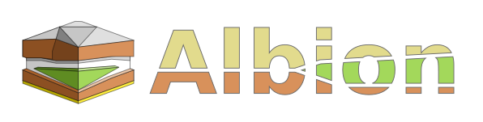
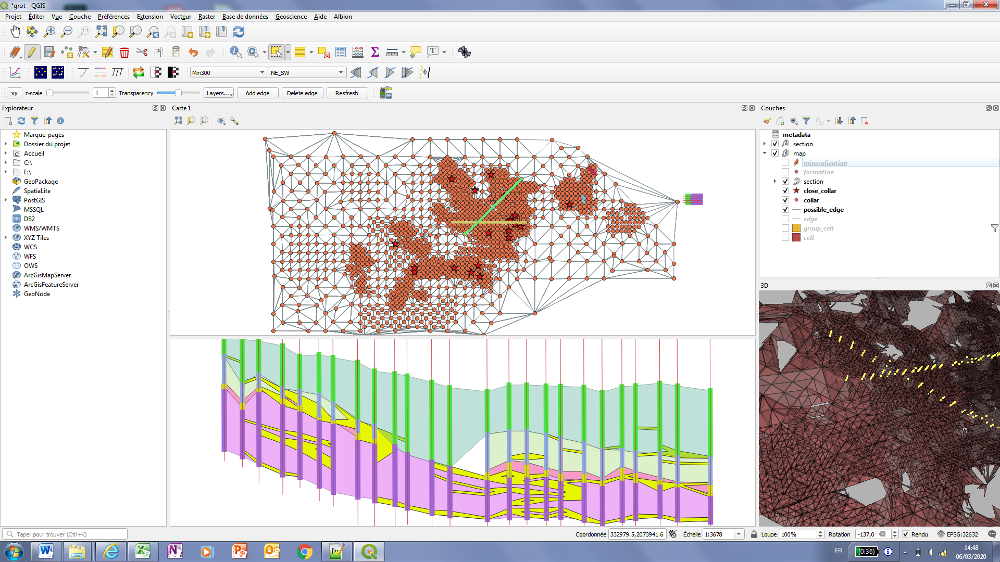
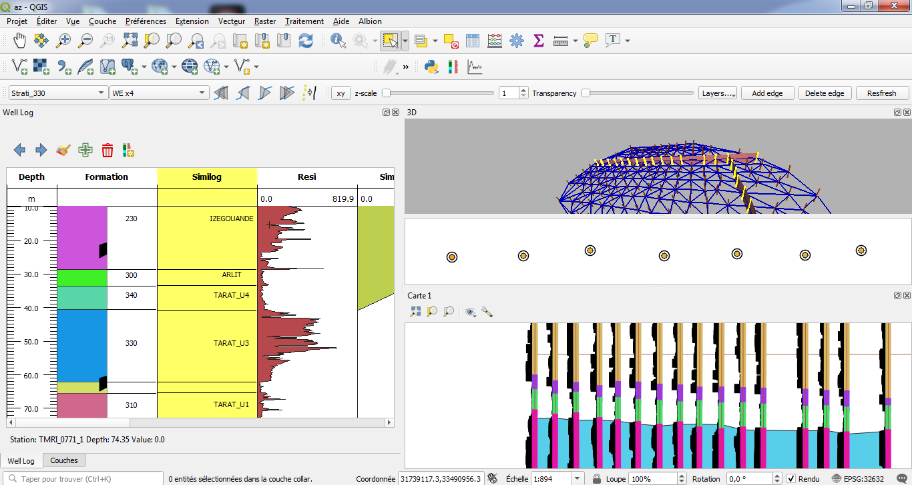
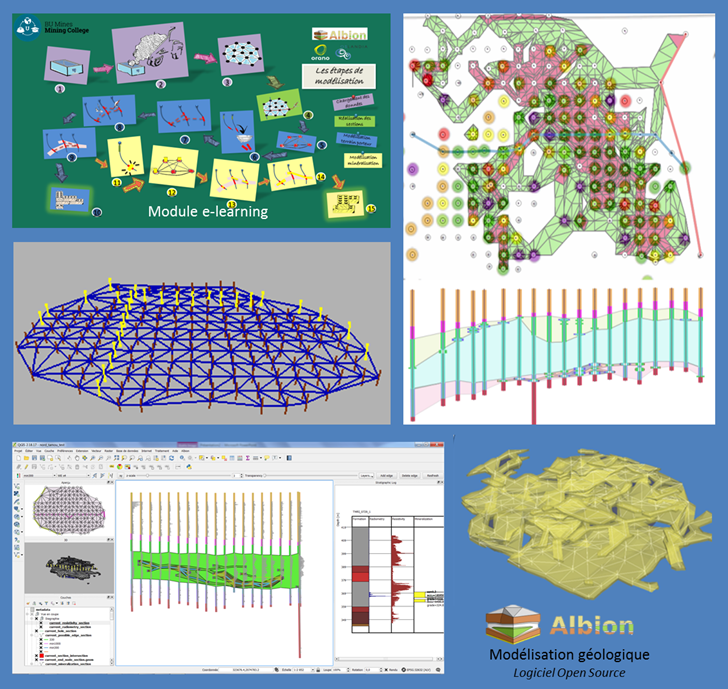

# Build 3D geological model from wells information

This plugin provides tools to **create 3D geological models in QGIS**, from borehole information.

It uses an innovative method of modeling stratigraphic layers in the form of a graph to facilitate volumetric reconstruction, and requires few user intervention. It allows geologists to perform underground modeling in 6 times less time than with previously used tools. A video [shows how it may be used](https://vimeo.com/326854657). 

And [this video by Vincent Mora explains **the founding concepts of Albion**](https://vimeo.com/328677023).

[Here is a quick install doc](quick_dev_install.md).

Some screenshots of the main interface, including 3D rendering : 

